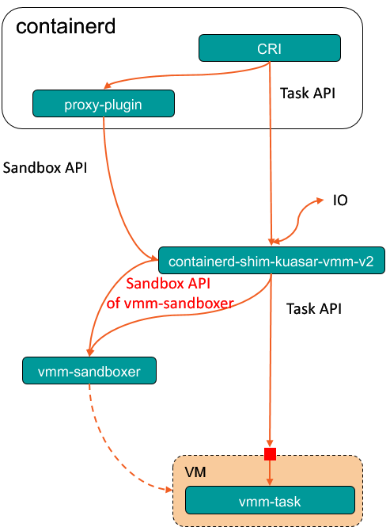

# What is kuasar shim?

Kuasar shim is a kind of CRI runtime V2 backend, it has connected to containerd and kuasar sandboxer process,
playing a role of "proxy". To be specific, it will forward Sandbox API to sandboxer and forward Task API
to low to tasker in low level indirectly, and try best not handle the original request. It was only created for linking
up containerd v1.7.0 and kuasar sandboxer, so maybe it will be **deprecated** in the future.



# Usage
This directory supply two shims, `containerd-shim-kuasar-vmm-v2` and `containerd-shim-kuasar-wasm-v2`.
The former one will talk to vmm-sandboxer and the later one will talk to wasm-sandboxer.

## Build

You need build it from source with root user before use it:

```shell
git clone https://github.com/kuasar-io/kuasar.git
cd kuasar/shim
make all
make install
```

## Run sandboxer

Shim starts a sandbox via Sandbox API of sandboxer, therefore shim needs to know about socket address that sandboxer is listening.
Currently, we set a fixed address `/run/vmm-sandboxer.sock` and `/run/wasm-sandboxer.sock` for shim, please make sure these sandboxers start with an args `--listen`.

## Install containerd

Download containerd v1.7.0 and ctr base on your machine form official release website: https://github.com/containerd/containerd/releases/tag/v1.7.0, and extract it under `/usr/local`:

```shell
curl -LJO https://github.com/containerd/containerd/releases/download/v1.7.0/containerd-1.7.0-linux-amd64.tar.gz
tar Cxzvf /usr/local containerd-1.7.0-linux-amd64.tar.gz
```

## Configure containerd

After that, containerd should know this runtime. Modify containerd configuration toml file on the host,
the default path is `/etc/containerd/config.toml`:

**Important!!!**: AppArmor feature is not support now, you need update `disable_apparmor = true` in the config file.

For vmm:
```toml
[plugins."io.containerd.grpc.v1.cri".containerd.runtimes.kuasar-vmm]
  runtime_type = "io.containerd.kuasar-vmm.v2"
  sandbox_mode = "shim"
```

For wasm:

```toml
[plugins."io.containerd.grpc.v1.cri".containerd.runtimes.kuasar-wasm]
  runtime_type = "io.containerd.kuasar-wasm.v2"
  sandbox_mode = "shim"
```

Please Make sure `runtime_type` and `sandbox_mode` is correct.

## Run containerd

To start containerd, run `ENABLE_CRI_SANDBOXES=1 containerd`

In order to use the containerd Sandbox API, the containerd daemon should be started with the environment variable `ENABLE_CRI_SANDBOXES=1`.

## Run the container

Use `kuasar-vmm` or `kuasar-wasm` as the CRI runtime type to run a container by shim.
