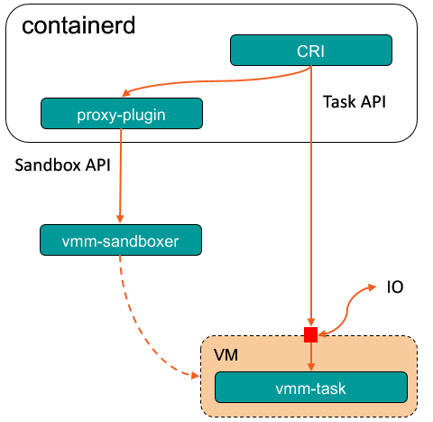

# Architecture
Kuasar-sandboxer is a sandboxer plugin of containerd. a sandboxer is a component of containerd for container sandbox lifecycle management. A sandbox should provide a set of task API to containerd for container lifecycle management. the `vmm-task` the PID 1 process running in the vm launched by vmm-sandboxer, it provides task API with the vsock connection.


# Installation Guide

## Prerequisites
kuasar should be running on bare metal of x86_64 arch, HostOS should be linux of 4.8 or higher, with hypervisor installed(qemu/stratovirt/cloud-hypervisor supported), Containerd with CRI plugin is also required. rust toolchains is required for compiling the source.

## Building from source

`x86_64-unknown-linux-musl` should be installed to make easy-to-deploy static linked or minimally dynamic linked programs in the building of `vmm-task`.

Build it with root user:

```sh
rustup target add x86_64-unknown-linux-musl
make bin/vmm-sandboxer
make bin/vmm-task
```

Additionally, kuasar dir should be created: `mkdir -p /var/lib/kuasar`.

## Building guest kernel
Guest kernel should also be linux of 4.8 or higher, with virtio-vsock enabled, make sure [this patch](https://lore.kernel.org/all/20191122070009.5CE442068E@mail.kernel.org/T/) is merged.
```
CONFIG_VSOCKETS=y
CONFIG_VSOCKETS_DIAG=y
CONFIG_VIRTIO_VSOCKETS=y
CONFIG_VIRTIO_VSOCKETS_COMMON=y
```

Run `make bin/vmlinux.bin` and `cp bin/vmlinux.bin /var/lib/kuasar/vmlinux.bin`

## Building guest os image

The guest os can be either a busybox or any linux distributions, but make the sure that the `vmm-task` be the init process. and make sure runc is installed.

Run `make bin/kuasar.img` and `cp bin/kuasar.img /var/lib/kuasar/kuasar.img`

## Config
Config cloud-hypervisor vmm-sandboxer, should copy the config file in vmm directory by `cp vmm/sandbox/config_clh.toml /var/lib/kuasar/config_clh.toml`.

The default config looks like this:
```toml
[sandbox]
[hypervisor]
  path = "/usr/local/bin/cloud-hypervisor"
  vcpus = 1
  memory_in_mb = 2048
  kernel_path = "/var/lib/kuasar/vmlinux.bin"
  image_path = "/var/lib/kuasar/kuasar.img"
  initrd_path = ""
  kernel_params = ""
  hugepages = false
  entropy_source = "/dev/urandom"
  debug = true
[hypervisor.virtiofsd]
  path = "/usr/local/bin/virtiofsd"
  log_level = "info"
  cache = "never"
  thread_pool_size = 4
```

# Run vmm-sandboxer as a systemd service

## Install and run kuasar-vmm systemd service

1. Run `make install-vmm` to install vmm-sandboxer related executable file, configuration files, and `kuasar-vmm` systemd service file into the destination directory. 
2. Start `kuasar-vmm` systemd service with `systemctl start kuasar-vmm.service` command. 
3. Check `kuasar-vmm` systemd service status with `systemctl status kuasar-vmm.service`.

The following output indicates that the `kuasar-vmm` systemd service is running properly.
```bash
$ sudo systemctl status kuasar-vmm.service 
● kuasar-vmm.service - Kuasar microVM type sandboxer daemon process
     Loaded: loaded (/usr/lib/systemd/system/kuasar-vmm.service; disabled; vendor preset: disabled)
     Active: active (running) since Thu 2023-07-13 15:33:18 CST; 56min ago
   Main PID: 3619585 (vmm-sandboxer)
      Tasks: 97 (limit: 1648354)
     Memory: 14.2M
     CGroup: /system.slice/kuasar-vmm.service
             └─3619585 /usr/local/bin/vmm-sandboxer --listen /run/vmm-sandboxer.sock --dir /run/kuasar-vmm

Jul 13 15:33:18 node systemd[1]: Starting Kuasar microVM type sandboxer daemon process...
Jul 13 15:33:18 node vmm-sandboxer[3619585]: [2023-07-13T07:33:18.905523Z INFO  containerd_sandbox] start sandbox plugin: kuasar-sandboxer
Jul 13 15:33:18 node systemd[1]: Started Kuasar microVM type sandboxer daemon process.
```

## Configure kuasar-vmm systemd service

The configuration file of the `kuasar-vmm` systemd service is stored in the `/etc/sysconfig/kuasar-vmm` file.

```bash
$ cat /etc/sysconfig/kuasar-vmm
# configure the vmm-sandboxer command options
OPTIONS='--listen /run/vmm-sandboxer.sock --dir /run/kuasar-vmm'
```


## Get kuasar-vmm service log

Since `vmm-sandboxer` daemon process is running as a `kuasar-vmm` systemd service, vmm-sandboxer's stdout/stderr outputs will be collected by systemd-journald journal service.

So you can use the `journalctl` command to get vmm-sandboxer process log:
```bash
$ journalctl -u kuasar-vmm.service -f

Jul 13 15:33:18 node systemd[1]: Starting Kuasar microVM type sandboxer daemon process...                                                       
Jul 13 15:33:18 node vmm-sandboxer[3619585]: [2023-07-13T07:33:18.905523Z INFO  containerd_sandbox] start sandbox plugin: kuasar-sandboxer      
Jul 13 15:33:18 node systemd[1]: Started Kuasar microVM type sandboxer daemon process.
Jul 13 15:33:41 node vmm-sandboxer[3619585]: [2023-07-13T07:33:41.636023Z INFO  containerd_sandbox::rpc] remove container c0da24a1e3c614fcb8bc70b76708ce2e8089c1f6386abc328973a8fff3ede761 from sandbox 31e668050c2031e9e7243720eaa8264c42b0283007e419948689cac2badb71cd
Jul 13 15:33:41 node vmm-sandboxer[3619585]: [2023-07-13T07:33:41.643792Z INFO  containerd_sandbox::rpc] stop sandbox 31e668050c2031e9e7243720eaa8264c42b0283007e419948689cac2badb71cd
Jul 13 15:33:41 node vmm-sandboxer[3619585]: [2023-07-13T07:33:41.644358Z ERROR vmm_sandboxer::stratovirt::virtiofs] vhost_user_fs exit signal: 9 (SIGKILL)
Jul 13 15:33:41 node vmm-sandboxer[3619585]: [2023-07-13T07:33:41.742550Z INFO  containerd_sandbox::rpc] shutdown sandbox 31e668050c2031e9e7243720eaa8264c42b0283007e419948689cac2badb71cd
```

# Developer  Guide

## Set up a debug console

Kuasar vmm supports setting up a shell debug console by adding `task.debug` to kernel_params in config file, this requires the guest image to include /bin/bash.

```toml
[hypervisor]
  kernel_params = "task.debug"
```

After starting pod, get the `vsock guest-cid` from vm process:

```bash
$ ps -ef | grep stratovirt | grep 5cbcf744949d8 
/usr/bin/stratovirt -name sandbox-5cbcf744949d8500e7159d6bd1e3894211f475549c0be15d9c60d3c502c7ede3 ...
-device vhost-vsock-pci,id=vsock-395568061,guest-cid=395568061,bus=pcie.0,addr=0x3,vhostfd=3 
...
```

Then developers could enter the guest os debug console shell environment by:

```bash
# ncat --vsock <guest-cid> <debug-console>
$ ncat --vsock 395568061 1025
```

# Note

Please note that this guide only teach you how to build kuasar from source code, if you want to run the kuasar, hypervisor and virtiofsd are also needed!
