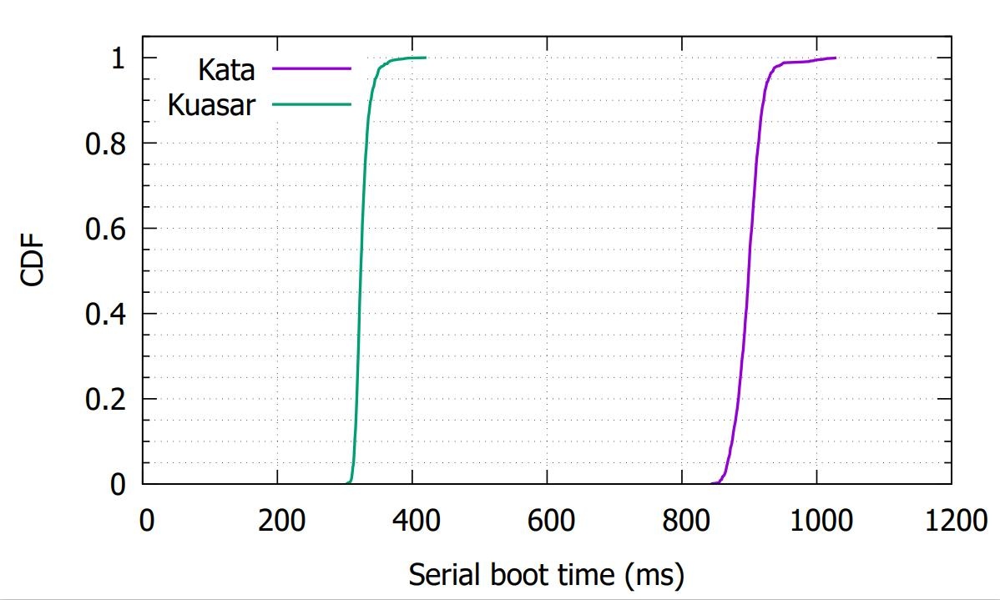
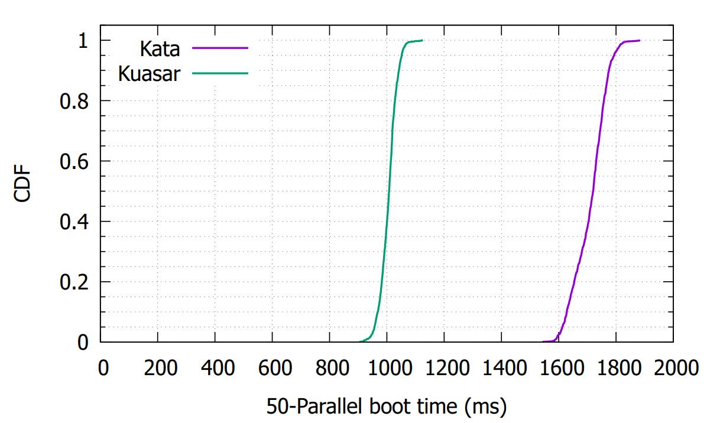
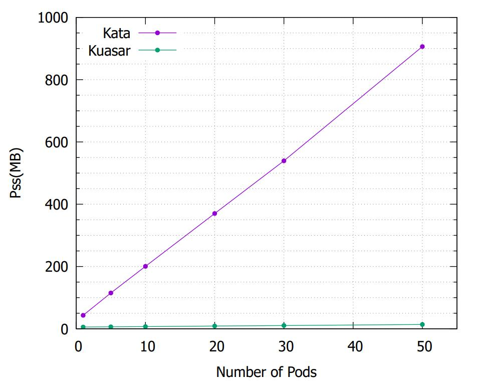

# Kuasar benchmarking code

This repository contains all the scripts, source code and data. 

- The benchmarking is divided into two groups: Kuasar and Kata. 

- In order to control variables consistently, we use: 
  
  - same versions of cloud-hypervisor and guest-kernel
  
  - same container image: docker.io/library/ubuntu:latest
  
  - all pods are created using the hostNetwork mode, which means that CNI plugins are not used
  
  - the container root filesystem storage driver uses overlayfs

- Performance Metrics: memory overhead & startup time
  
  - memory overhead:
    
    Start 1/5/10/20/30/50 pods，measure the Pss of Kuasar's sandboxer process and the total Pss of all `containerd-shim-kata-v2` processes. The Pss is obtained from the smaps_rollup file under the `/proc` dictionary.
    
    Measure three times and take the average value.
  
  - startup time: 
    
    The container startup time (including pod startup time) measured end-to-end through CRI. The testing is divided into two groups, one launching a single pod and the other launching 30 pods in parallel. Every group runs 500 times and obtains CDF data.

---

## Test Environment

|                  | version  |
|------------------|----------|
| Contained        | v1.7.0   |
| Kata             | v2.5.2   |
| Operation System | centOS 8 |
| Cloud-Hypervisor | v28.2    |
| Guest-kernel     | 6.1.6    |

---

## Test Procedure

### 1. Launch containerd

```bash
ENABLE_CRI_SANDBOXES=1 ./contained -l=info

#for kata we just use ./contained -l=info
```

### 2. Launch Vmm-sandboxer

```bash
~/kuasar/vmm/target/x86_64-unknown-linux-musl/release/vmm-sandboxer --listen /run/kuasar-sandboxer.sock --dir /var/lib/kuasar

#for kata we should skip this step
```

### 3. Running the tests

There are a bunch of scripts in `./scripts`. They assume you are in the `./scripts` directory when you run them.

```bash
cd ./scripts
```

- Time tests
  
  ```bash
  sh boot-serial-kuasar-time.sh
  ```
  
  In `./data/raw` we could get the `.dat` file as the result of the script we run just now. For example `boot-serial-1000-kuasar-time.dat`.
  
  Then we use the command below to generate cdf file:
  
  ```bash
  ./util_gen_cdf.py ../data/raw/boot-serial-1000-kuasar-time.dat ../data/boot-serial-1000-kuasar-time-cdf.dat
  ```

- Memory tests
  
  ```bash
  sh kuasar-mem-test.sh
  ```

  Measure three times, record the result and take the average value.

### 4. Generate Graph

We use gnuplot to generate graph.

Make sure that your `.dat` files and `.gpl` scripts are in the same dictionary. Or you can modify the `.gpl` scripts to specify the path and name of the `.dat` files.

Run the `.gpl` script, and you will get the PDF file.



Figure1: Cumulative distribution of wall-clock times for starting container in serial, for Kata and Kuasar.


The boot time of Kata is about 850~950 ms while Kuasar is only 300~360 ms, which less than half of Kata.



Figure2: Cumulative distribution of wall-clock times for starting containers in groups of 50 in parallel, for Kata and Kuasar.


The boot time of Kata is about 1600~1800 ms while Kuasar is only 930~1050 ms, which nearly half of Kata.



Figure3: Memory overhead (Pss) for Kuasar's sandboxer process and all the processes of Kata-shim.


With the number of pods increases, the memory overhead of Kuasar's sandboxer grows very slowly.When the number of pods comes to 50, Pss is only about 15 MB.

On the other hand, the average Pss of each pods for Kata is about 18 MB, which significantly higher than Kuasar.

---
